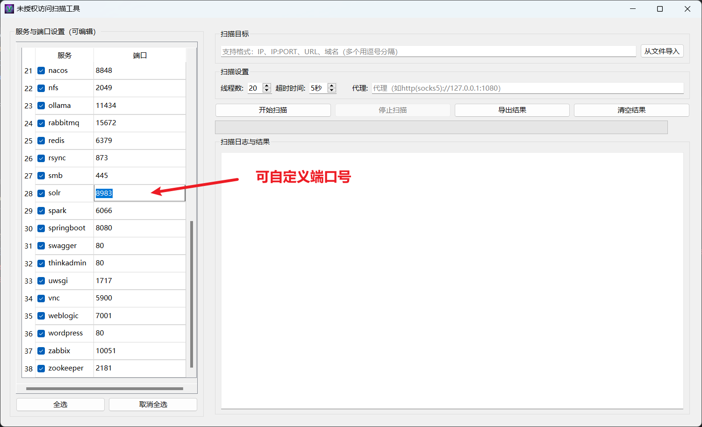
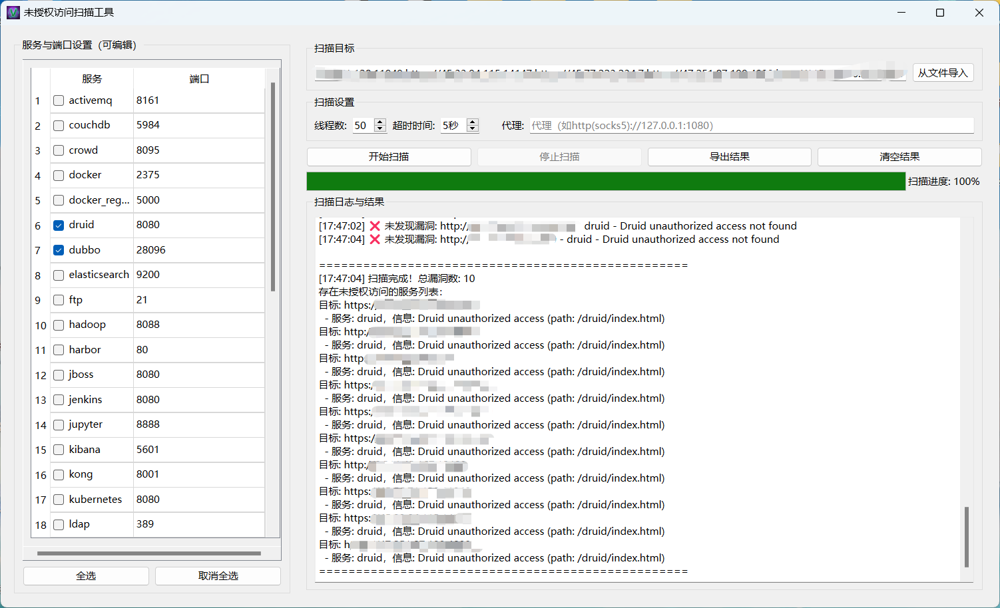
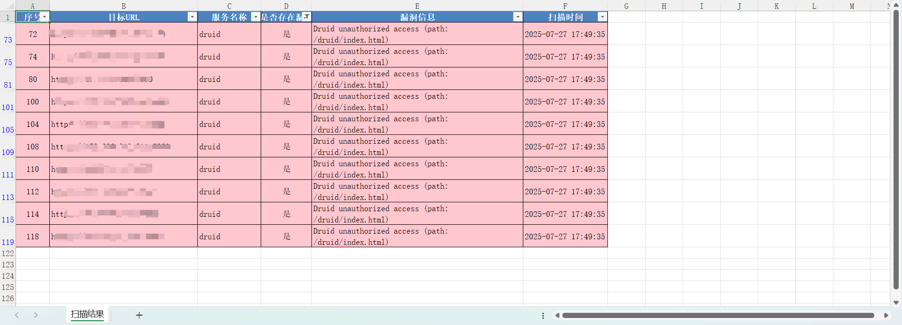

# Unauthorized_VUL_GUI

一款最全未授权访问漏洞批量检测工具，集成40+常见未授权访问漏洞；使用PYQT6，为其添加了GUI界面

1.弥补了源代码中不支持自定义端口的功能

2.导出功能支持excel数据导出，存在未授权访问漏洞的会用红色标识

### GUI显示

扫描过程&结果

导出结果显示，可能存在漏洞的地址会被标红

## 参考链接

- https://github.com/hackerchuan1/Unauthorized_VUl

